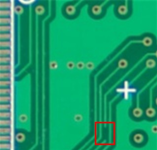
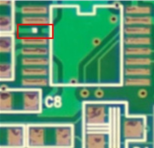
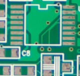
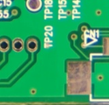

# PCB 결함 판별 기준 정리

## 1. 개요
본 문서는 PCB 결함 탐지 프로젝트에서 사용된 결함 유형과,
각 결함을 판별하기 위한 기준을 정리한 문서이다.
본 기준은 후임자가 데이터셋 및 AI 모델 결과를 이해하고,
PCB 결함 판단 기준을 명확히 파악할 수 있도록 작성되었다.

## 2. 사용 이미지 데이터 개요
본 프로젝트에서는 PCB 표면 이미지를 기반으로 결함을 판별한다.
결함은 객체 탐지(Object Detection) 방식으로 정의되며,
총 4가지 결함 유형(Open, Pad Open, Short, Silk)을 대상으로 한다.

---

## 3. 결함 유형별 판별 기준

### (1) Open

- **설명**  
  회로 패턴이 끊어져 전기적으로 연결되지 않은 결함

- **육안 특징**
  - 패턴이 중간에서 단절되어 있음
  - 선의 연속성이 명확히 사라짐

- **판별 기준**
  - 정상 PCB 대비 패턴이 물리적으로 끊어져 있음
  - 단절 지점이 시각적으로 확인 가능함

- **비고**
  - 미세 단선의 경우 해상도 및 조명 조건에 따라 식별이 어려울 수 있음
  - 이미지가 잘린 부분에 불량이 존재하는 경우 식별이 어려울 수 있음
  - 실크가 위에 덮여진 경우 단절된 부분이 시각적으로 쉽게 식별하기 어려울 수 있음

---

### (2) Pad Open

- **설명**  
  패드 표면에 납땜이 제대로 이루어지지 않은 상태를 의미하는 결함

- **육안 특징**
  - 패드 외형은 존재하나 표면이 비어 있음
  - 납이 형성되지 않은 원형 또는 링 형태가 관찰됨

- **판별 기준**
  - 패드는 존재하나 납땜이 이루어지지 않아 전기적 접속이 불가능한 상태
  - 동일 PCB 내 정상 패드와 비교 시 표면 상태가 현저히 다름
  - 인접 패턴은 정상이나 패드 기능이 상실됨

- **구분 포인트**
  - Open: **패턴 자체가 끊어진 경우**
  - Pad Open: **패드는 있으나 납땜이 이루어지지 않은 경우**

- **비고**
  - 본 프로젝트에서는 패드 내부가 비어 보이거나
    납땜 흔적이 없는 경우를 Pad Open으로 정의함
  - 이미지가 잘린 부분(모서리 등)에 불량이 존재하는 경우 식별이 어려울 수 있음

---

### (3) Short

- **설명**  
  분리되어야 할 회로 패턴 또는 패드 간이 비정상적으로 연결된 결함

- **육안 특징**
  - 패턴 사이 간격이 사라짐
  - 얇은 연결선, 번짐, 구리 잔여물 등이 관찰됨
  - 홀(작은 구멍)이 실크 또는 회로, 패드와 겹친 경우도 쇼트로 구분함

- **판별 기준**
  - 인접한 패턴 또는 패드가 물리적으로 연결되어 있음
  - 정상 간격 대비 간격이 현저히 감소하거나 소실됨
  - 홀(작은 구멍)이 실크 또는 회로, 패드와 겹쳐져 있음

- **비고**
  - 조명 반사나 오염으로 인해 오탐지 가능성 존재
  - 다른 불량에 비해서 작은 크기의 미세한 불량이므로 식별이 어려울 수 있음
  - 실크가 위에 덮여진 경우 불량 부분이 시각적으로 쉽게 식별하기 어려울 수 있음

---

### (4) Silk

- **설명**  
  실크 인쇄(Silkscreen)가 회로 패턴 또는 패드 영역을 침범한 결함

- **육안 특징**
  - 문자, 숫자, 기호 등이 패턴 위에 겹쳐 있음
  - 흰색 또는 연한 색상의 실크 잔여물 관찰

- **판별 기준**
  - 실크 인쇄 영역이 전기적 패턴 또는 패드를 침범함
  - 정상 PCB 대비 인쇄 위치가 부적절함

- **비고**
  전기적 불량은 아니나 품질 기준상 불량으로 분류됨

---

## 4. AI 모델에서의 활용 방식
본 프로젝트에서는 상기 결함을 객체 탐지 문제로 정의하였다.
각 결함은 bounding box 단위로 라벨링되며,
모델은 입력 이미지로부터 결함의 위치와 유형을 동시에 예측한다.

---

## 5. 주의사항 및 한계
- 결함 판별은 이미지 해상도, 조명, 촬영 조건에 영향을 받음
- 일부 결함은 사람 기준과 모델 판단 간 차이가 발생할 수 있음
- 본 기준은 본 프로젝트에서 사용된 데이터셋에 한정됨

---

## 6. 데이터셋 파일 네이밍 규칙 (부록)

본 프로젝트에서 사용된 PCB 이미지 데이터셋은
파일 이름에 따라 결함 유형을 구분할 수 있도록 구성되어 있다.
각 알파벳은 포함된 결함 종류를 의미하며,
'_front', '_back'은 PCB의 촬영 면(front/back)을 나타낸다.

| 파일 구분 | 포함 결함 유형 |
|----------|----------------|
| A_back / A_front | Open |
| B_back / B_front | Short |
| C_back / C_front | Pad Open |
| D_back / D_front | Silk |
| E_back / E_front | Open, Short |
| F_back / F_front | Open, Short, Pad Open, Silk |
| H_back / H_front | Open, Short, Pad Open, Silk |
| X_back / X_front | Open, Short, Pad Open, Silk |

본 네이밍 규칙은 데이터셋 관리 및 라벨 확인을 위한 용도로 사용되며,
실제 결함 판별은 이미지 기반 기준을 따른다.
